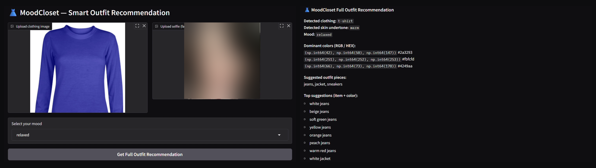

# MoodCloset 👗
### A Multi-Stage AI System for Personalized Outfit Recommendations

MoodCloset suggests outfits that match both **how you feel** and **what flatters you**. Upload a photo of a clothing item and a selfie, pick your mood, and the system recommends colours and matching pieces tailored to your skin undertone and emotional state.

**Course:** CS3081 – Artificial Intelligence, Effat University (Fall 2025)
**Instructor:** Dr. Passent Elkafrawy
**Team:** Aseel Bajaber, Jumanah Al-Nahdi, Jwdee Alamam

---

## The Problem

Most fashion recommenders rely on purchase history or text searches. They ignore two things that matter a lot when choosing what to wear: your **skin undertone**, which decides which colours suit you, and your **mood**. MoodCloset combines visual analysis with emotional input to close that gap.

## How It Works

MoodCloset is a hybrid pipeline that combines deep learning, classic image processing, and rule-based logic. Each stage feeds the next:

| Stage | What it does | Technique |
|---|---|---|
| 1. Data preparation | Resize, normalize, and augment training images | `ImageDataGenerator` (rotation, zoom, flip) |
| 2. Clothing classification | Identify the clothing type | **MobileNetV2** with transfer learning |
| 3. Dominant colour extraction | Find the top 3 colours of the garment | **K-Means** (k = 3) |
| 4. Skin undertone detection | Classify the selfie as Warm, Cool, or Neutral | K-Means + rule-based RGB analysis |
| 5. Mood mapping | Map the chosen mood to a colour palette | Colour psychology dictionaries |
| 6. Final recommendation | Pick colours in **both** the mood and undertone palettes, then pair matching items | Intersection rule + pairing rules |

### Classification model

- **Base:** MobileNetV2 pre-trained on ImageNet, base layers frozen
- **Head:** GlobalAveragePooling2D → Dense(256, ReLU) → Dropout(0.5) → Softmax
- **Training:** Adam (lr = 1e-4), categorical cross-entropy, 15–20 epochs
- **Classes (10):** dress, hat, longsleeve, outwear, pants, shirt, shoes, shorts, skirt, t-shirt
- **Dataset:** [Clothing Dataset Small](https://github.com/alexeygrigorev/clothing-dataset-small) by Alexey Grigorev

## Results

| Metric | Score |
|---|---|
| Training accuracy | 89.55% |
| Validation accuracy | **82.40%** |

- Precision was high across most categories. The main confusion was between visually similar items such as skirts and shorts.
- Human evaluators rated the final recommendations on colour harmony, mood matching, and undertone suitability, with positive results.

## Interface

The system runs as an interactive web app built with **Gradio**. Users upload a clothing image and a selfie, choose a mood (happy, calm, confident, relaxed), and get:

- The detected clothing type and skin undertone
- The garment's dominant colours (RGB / HEX)
- Suggested matching pieces
- Top item + colour recommendations

## Limitations and Future Work

- **Manual mood input:** add facial expression recognition to detect mood from the selfie automatically
- **Lighting sensitivity:** train a dedicated CNN for undertone classification that is robust to lighting
- **Dataset size:** a larger, more diverse dataset would improve generalization
- **Personalization:** explore collaborative filtering or reinforcement learning to learn each user's style over time

## Tech Stack

Python · TensorFlow / Keras · MobileNetV2 · scikit-learn · NumPy · Pillow · Matplotlib · Gradio · Google Colab

## Repository Contents

| File | Description |
|---|---|
| `Moodcloset.ipynb` | Full pipeline: training, colour extraction, undertone detection, recommendation engine, and Gradio app |
| `moodcloset_model.h5` | Trained MobileNetV2 clothing classifier |
| `AI_Final_Project_Report.pdf` | Technical report |
| `AI_Project_Presentation.pptx` | Project presentation |
| `requirements.txt` | Python dependencies |

## Run It

1. Open `Moodcloset.ipynb` in [Google Colab](https://colab.research.google.com/)
2. Install the dependencies: `pip install -r requirements.txt`
3. Run all cells. The last cell launches the Gradio interface with a shareable link.
